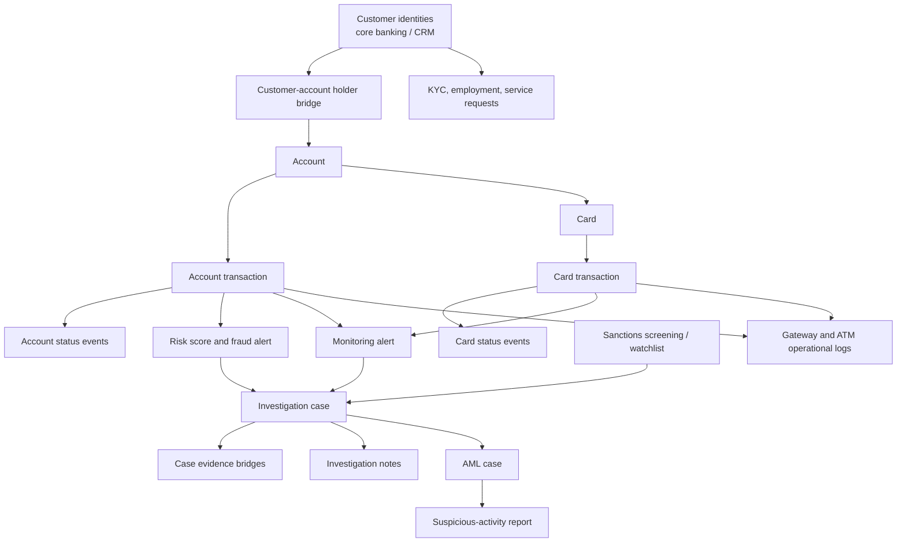
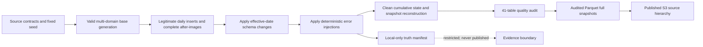
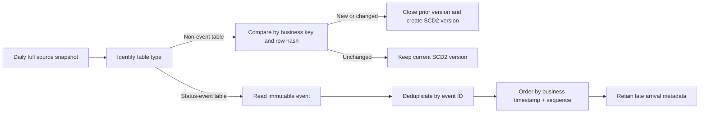

# Synthetic Banking Mock Data

## Context

**Transaction investigation context:** mock transactions, dispute cases, merchant categories, and investigation notes.

**Repository:** [mock-data-generator](https://github.com/skadi2910/mock-data-generator)

This document describes a synthetic banking Bronze/source environment used to test transaction investigation, data engineering, data-quality controls, and downstream analytics. It is intentionally self-contained and uses safe masked examples only; it does not disclose real customer values, confidential source details, or internal locations.

## Scope at a glance

| Item | Design |
|---|---|
| Published scope | 41 source tables across four domains |
| Delivery series | Six complete daily snapshots: 5–10 July 2026 |
| Latest full snapshot | 6,241,418 rows on 10 July 2026 |
| Data model | Valid relational base population followed by deterministic, labelled error injections |
| Raw-data boundary | Synthetic PII, payment identifiers, and investigations are restricted; raw Bronze and the truth manifest are not AI inputs |

## Generation and delivery flow

```mermaid
flowchart LR
    A[Configuration and deterministic seed] --> B[Generate valid Customer Master base]
    B --> C[Generate valid Customer Transaction and Card base]
    C --> D[Generate valid Financial Crime relationships]
    D --> E[Apply labelled error-injection rules]
    E --> F[Create local-only truth manifest]
    E --> G[Run quality and referential checks]
    G --> H[Reconstruct full daily snapshot]
    H --> I[Audit published tables and row counts]
    I --> J[Publish audited Parquet full snapshot to controlled S3]
    F -. never published / never direct AI access .-> K[Restricted evidence boundary]
    J --> L[Approved downstream data consumers]
    L --> M[Masked or tokenised AI-safe view]
```



The generator starts from an internal 4 July seed. For each 5–10 July business date it creates source-system changes, resolves the clean base dependency order, applies controlled defects, and reconstructs a full point-in-time snapshot. Only audited full Parquet snapshots are delivered; raw daily extracts, manifests, build state, and quality reports remain excluded.

## Relationship model



The arrows show logical source relationships. A mixed customer reference in a raw table can point to either a core-banking or CRM source identifier; identity conformance occurs downstream, not in Bronze.

## Domain volumes

| Domain | Tables | 10 July rows | Primary purpose |
|---|---:|---:|---|
| Customer Master | 7 | 560,613 | Identity, KYC, employment, servicing, accounts, and holders |
| Customer Transaction | 10 | 3,240,965 | Account postings, status events, merchant context, ATM/gateway logs, balances |
| Card | 5 | 1,659,882 | Card instruments, card transactions, lifecycle events, fraud flags, limits |
| Financial Crime | 19 | 779,958 | Risk scores, alerts, cases, AML/sanctions, evidence, notes, reporting |
| **Total** | **41** | **6,241,418** | Full point-in-time source image |

## Source-table data dictionary

### Reading the table dictionaries

- **Required** means `yes` when the raw schema declares a primary key or non-null field. A nullable value can still be made invalid by a labelled error rule.
- **Key / reference** distinguishes primary/unique keys from source references. A reference may intentionally be unresolved in an injected row.
- **Classification** tells consumers whether a field is internal, sensitive, restricted, contact, or financial/risk data.
- **Error injected** gives the exact controlled condition, rate, and expected downstream handling for the field or event row.
- **Injected example** shows the safe, non-production changed value; no real names, identifiers, phone numbers, email addresses, accounts, PANs, or confidential content are shown.


### Customer Master

#### `core_banking_customer`

**10 July volume:** 87,369 rows  \
**Grain:** source entity / relationship snapshot (SCD2-ready)  \
**Primary key:** `cust_no`

| Field | Type | Required | Key / reference | Accepted values | Classification | Error injected | Injected example |
|---|---|---|---|---|---|---|---|
| `cust_no` | `varchar` | yes | PK | source-controlled / free text | internal | — | — |
| `cif_number` | `varchar` | no | Unique | source-controlled / free text | internal | — | — |
| `full_name` | `varchar` | no | — | source-controlled / free text | direct identifier | — | — |
| `date_of_birth` | `date` | no | — | ISO date | sensitive | Set to `NULL`.<br>**Rate:** 2.5%<br>**Handling:** `QUARANTINE_FIELD` | `NULL` |
| `national_id` | `varchar` | no | — | source-controlled / free text | sensitive | Copy another row's value, creating a duplicate national ID.<br>**Rate:** 0.8333%<br>**Handling:** `DEDUPLICATE`<br><br>Set to `NULL`.<br>**Rate:** 4.1667%<br>**Handling:** `QUARANTINE_FIELD` | `[copied synthetic identifier]`<br>`NULL` |
| `phone` | `varchar` | no | — | source-controlled / free text | contact | Replace with the placeholder `0000000000`.<br>**Rate:** 2.5%<br>**Handling:** `QUARANTINE_FIELD` | `[placeholder synthetic phone]` |
| `address` | `varchar` | no | — | source-controlled / free text | sensitive | — | — |
| `source_system` | `varchar` | no | — | source-controlled / free text | internal | — | — |
| `created_date` | `date` | no | — | ISO date | internal | — | — |

#### `crm_customer`

**10 July volume:** 65,527 rows  \
**Grain:** source entity / relationship snapshot (SCD2-ready)  \
**Primary key:** `party_id`

| Field | Type | Required | Key / reference | Accepted values | Classification | Error injected | Injected example |
|---|---|---|---|---|---|---|---|
| `party_id` | `varchar` | yes | PK | source-controlled / free text | internal | — | — |
| `customer_name` | `varchar` | no | — | source-controlled / free text | direct identifier | — | — |
| `phone` | `varchar` | no | — | source-controlled / free text | contact | — | — |
| `national_id` | `varchar` | no | — | source-controlled / free text | sensitive | Set to `NULL`.<br>**Rate:** 5.0%<br>**Handling:** `QUARANTINE_FIELD` | `NULL` |
| `email` | `varchar` | no | — | source-controlled / free text | contact | Set to `NULL`.<br>**Rate:** 3.125%<br>**Handling:** `QUARANTINE_FIELD`<br><br>Replace with `malformed-email`.<br>**Rate:** 1.875%<br>**Handling:** `QUARANTINE_FIELD` | `NULL`<br>`malformed-email` |
| `preferred_contact_method` | `varchar` | no | — | source-controlled / free text | internal | — | — |
| `source_system` | `varchar` | no | — | source-controlled / free text | internal | — | — |
| `created_date` | `date` | no | — | ISO date | internal | — | — |

#### `customer_kyc`

**10 July volume:** 78,636 rows  \
**Grain:** source entity / relationship snapshot (SCD2-ready)  \
**Primary key:** `kyc_id`

| Field | Type | Required | Key / reference | Accepted values | Classification | Error injected | Injected example |
|---|---|---|---|---|---|---|---|
| `kyc_id` | `varchar` | yes | PK | source-controlled / free text | internal | — | — |
| `customer_ref` | `varchar` | no | — | source-controlled / free text | internal | Replace with unresolved `UNKNOWN-CUSTOMER`.<br>**Rate:** 1.0%<br>**Handling:** `QUARANTINE_RECORD` | `UNKNOWN-CUSTOMER` |
| `id_type` | `varchar` | no | — | source-controlled / free text | internal | — | — |
| `id_number` | `varchar` | no | — | source-controlled / free text | sensitive | Replace with malformed `INVALID-ID`.<br>**Rate:** 2.0%<br>**Handling:** `QUARANTINE_FIELD` | `INVALID-ID` |
| `verification_status` | `varchar` | no | — | source-controlled / free text | internal | — | — |
| `verified_date` | `date` | no | — | ISO date | internal | — | — |

#### `customer_employment`

**10 July volume:** 52,424 rows  \
**Grain:** source entity / relationship snapshot (SCD2-ready)  \
**Primary key:** `employment_id`

| Field | Type | Required | Key / reference | Accepted values | Classification | Error injected | Injected example |
|---|---|---|---|---|---|---|---|
| `employment_id` | `varchar` | yes | PK | source-controlled / free text | internal | — | — |
| `customer_ref` | `varchar` | no | — | source-controlled / free text | internal | Replace with unresolved `UNKNOWN-CUSTOMER`.<br>**Rate:** 1.0%<br>**Handling:** `QUARANTINE_RECORD` | `UNKNOWN-CUSTOMER` |
| `employer_name` | `varchar` | no | — | source-controlled / free text | direct identifier | — | — |
| `job_title` | `varchar` | no | — | source-controlled / free text | internal | — | — |
| `monthly_income` | `decimal(12,2)` | no | — | numeric range | financial / risk | Set to `-1000.00`, below the valid minimum of zero.<br>**Rate:** 1.0%<br>**Handling:** `QUARANTINE_RECORD` | `-1000.00` |

#### `customer_request`

**10 July volume:** 38,139 rows  \
**Grain:** source entity / relationship snapshot (SCD2-ready)  \
**Primary key:** `request_id`

| Field | Type | Required | Key / reference | Accepted values | Classification | Error injected | Injected example |
|---|---|---|---|---|---|---|---|
| `request_id` | `varchar` | yes | PK | source-controlled / free text | internal | — | — |
| `customer_ref` | `varchar` | no | — | source-controlled / free text | internal | Replace with unresolved `UNKNOWN-CUSTOMER`.<br>**Rate:** 1.0%<br>**Handling:** `QUARANTINE_RECORD` | `UNKNOWN-CUSTOMER` |
| `request_type` | `varchar` | no | — | source-controlled / free text | internal | — | — |
| `channel` | `varchar` | no | — | source-controlled / free text | internal | — | — |
| `request_date` | `date` | no | — | ISO date | internal | — | — |
| `status` | `varchar` | no | — | source-controlled / free text | internal | — | — |
| `resolution_date` | `date` | no | — | ISO date | internal | — | — |
| `description` | `varchar` | no | — | source-controlled / free text | restricted content | Set to `NULL`.<br>**Rate:** 4.0%<br>**Handling:** `QUARANTINE_FIELD` | `NULL` |

#### `customer_account`

**10 July volume:** 124,937 rows  \
**Grain:** source entity / relationship snapshot (SCD2-ready)  \
**Primary key:** `link_id`

| Field | Type | Required | Key / reference | Accepted values | Classification | Error injected | Injected example |
|---|---|---|---|---|---|---|---|
| `link_id` | `varchar` | yes | PK | source-controlled / free text | internal | — | — |
| `cif_number` | `varchar` | yes | — | source-controlled / free text | internal | — | — |
| `account_id` | `bigint` | yes | — | source-controlled / free text | internal | Replace with unresolved `-1`.<br>**Rate:** 1.0%<br>**Handling:** `QUARANTINE_RECORD` | `-1` |
| `relationship_type` | `varchar` | no | — | source-controlled / free text | internal | — | — |
| `linked_date` | `date` | no | — | ISO date | internal | — | — |

#### `account`

**10 July volume:** 113,581 rows  \
**Grain:** source entity / relationship snapshot (SCD2-ready)  \
**Primary key:** `account_id`

| Field | Type | Required | Key / reference | Accepted values | Classification | Error injected | Injected example |
|---|---|---|---|---|---|---|---|
| `account_id` | `bigint` | yes | PK | source-controlled / free text | internal | — | — |
| `customer_ref` | `varchar` | no | FK → core_banking_customer.cust_no | source-controlled / free text | internal | — | — |
| `cif_number` | `varchar` | no | — | source-controlled / free text | internal | Replace with unresolved `CIF99999999`.<br>**Rate:** 1.0%<br>**Handling:** `QUARANTINE_RECORD` | `CIF99999999` |
| `product_type` | `varchar` | no | — | source-controlled / free text | internal | — | — |
| `status` | `varchar` | no | — | source-controlled / free text | internal | — | — |
| `open_date` | `date` | no | — | ISO date | internal | — | — |
| `branch_code` | `varchar` | no | — | source-controlled / free text | internal | — | — |
| `servicing_model` | `varchar` | no | — | source-controlled / free text | internal | — | — |

### Customer Transaction

#### `account_transaction_status_event`

**10 July volume:** 1,744,290 rows  \
**Grain:** immutable status-change event (CDC)  \
**Primary key:** `status_event_id`

| Field | Type | Required | Key / reference | Accepted values | Classification | Error injected | Injected example |
|---|---|---|---|---|---|---|---|
| `status_event_id` | `varchar` | yes | PK | source-controlled / free text | internal | Duplicate the status-event row as a replay.<br>**Rate:** 1.0%<br>**Handling:** `DEDUPLICATE` | `[replayed immutable event row]` |
| `account_txn_id` | `bigint` | yes | Unique | source-controlled / free text | internal | Replace with unresolved `-1`.<br>**Rate:** 1.0%<br>**Handling:** `QUARANTINE_RECORD` | `-1` |
| `status` | `varchar` | yes | — | INITIATED / PENDING / SUCCESS / REJECTED / CANCELED | internal | — | — |
| `status_timestamp` | `timestamp` | yes | — | ISO-8601 timestamp | internal | — | — |
| `source_arrival_timestamp` | `timestamp` | yes | — | ISO-8601 timestamp | internal | Shift the sequence-0 event 600 seconds later. Business time and sequence remain correct.<br>**Rate:** 1.0% of initial events<br>**Handling:** `PROCESS_BY_ARRIVAL_ORDER` | `source-arrival timestamp +600 seconds` |
| `sequence_number` | `bigint` | yes | — | source-controlled / free text | internal | — | — |

#### `atm_transaction_status_event`

**10 July volume:** 264,330 rows  \
**Grain:** immutable status-change event (CDC)  \
**Primary key:** `status_event_id`

| Field | Type | Required | Key / reference | Accepted values | Classification | Error injected | Injected example |
|---|---|---|---|---|---|---|---|
| `status_event_id` | `varchar` | yes | PK | source-controlled / free text | internal | — | — |
| `log_id` | `varchar` | yes | FK → log_atm.log_id | source-controlled / free text | internal | Replace with unresolved `UNKNOWN-ATM-LOG`.<br>**Rate:** 1.0%<br>**Handling:** `QUARANTINE_RECORD` | `UNKNOWN-ATM-LOG` |
| `account_txn_id` | `bigint` | no | FK → account_transaction.account_txn_id | source-controlled / free text | internal | — | — |
| `status` | `varchar` | yes | — | source-controlled / free text | internal | — | — |
| `status_timestamp` | `timestamp` | yes | — | ISO-8601 timestamp | internal | — | — |
| `source_arrival_timestamp` | `timestamp` | yes | — | ISO-8601 timestamp | internal | — | — |
| `sequence_number` | `bigint` | yes | — | source-controlled / free text | internal | — | — |

#### `payment_gateway_status_event`

**10 July volume:** 324,330 rows  \
**Grain:** immutable status-change event (CDC)  \
**Primary key:** `status_event_id`

| Field | Type | Required | Key / reference | Accepted values | Classification | Error injected | Injected example |
|---|---|---|---|---|---|---|---|
| `status_event_id` | `varchar` | yes | PK | source-controlled / free text | internal | — | — |
| `gateway_txn_id` | `varchar` | yes | FK → payment_gateway_log.gateway_txn_id | source-controlled / free text | internal | Replace with unresolved `UNKNOWN-GATEWAY-LOG`.<br>**Rate:** 1.0%<br>**Handling:** `QUARANTINE_RECORD` | `UNKNOWN-GATEWAY-LOG` |
| `account_txn_id` | `bigint` | no | FK → account_transaction.account_txn_id | source-controlled / free text | internal | — | — |
| `card_txn_id` | `bigint` | no | FK → card_transaction.card_txn_id | source-controlled / free text | internal | — | — |
| `status` | `varchar` | yes | — | source-controlled / free text | internal | — | — |
| `status_timestamp` | `timestamp` | yes | — | ISO-8601 timestamp | internal | — | — |
| `source_arrival_timestamp` | `timestamp` | yes | — | ISO-8601 timestamp | internal | — | — |
| `sequence_number` | `bigint` | yes | — | source-controlled / free text | internal | — | — |

#### `account_transaction`

**10 July volume:** 575,674 rows  \
**Grain:** source entity / relationship snapshot (SCD2-ready)  \
**Primary key:** `account_txn_id`

| Field | Type | Required | Key / reference | Accepted values | Classification | Error injected | Injected example |
|---|---|---|---|---|---|---|---|
| `account_txn_id` | `bigint` | yes | PK | source-controlled / free text | internal | — | — |
| `account_id` | `bigint` | no | FK → account.account_id | source-controlled / free text | internal | Replace with unresolved `-1`.<br>**Rate:** 1.0%<br>**Handling:** `QUARANTINE_RECORD` | `-1` |
| `customer_ref` | `varchar` | no | FK → core_banking_customer.cust_no | source-controlled / free text | internal | — | — |
| `amount` | `decimal(12,2)` | no | — | numeric range | financial / risk | Set to `-100.00` for otherwise valid `CREDIT` transactions.<br>**Rate:** 1.0% of credits<br>**Handling:** `QUARANTINE_RECORD` | `-100.00` |
| `transaction_type` | `varchar` | no | — | DEPOSIT / WITHDRAWAL / TRANSFER / FEE / INTEREST / REVERSAL / ACCOUNT_PAYMENT | internal | — | — |
| `direction` | `varchar` | no | — | DEBIT / CREDIT | internal | — | — |
| `txn_timestamp` | `timestamp` | no | — | ISO-8601 timestamp | internal | — | — |
| `status` | `varchar` | no | — | Latest source state only: INITIATED / PENDING / SUCCESS / REJECTED / CANCELED. Full state-change history is retained in account_transaction_status_event. | internal | Change clean `SUCCESS` to conflicting `FAILED`; event history remains intact.<br>**Rate:** 1.0% of successful transactions<br>**Handling:** `RECONCILE_LATEST_STATUS` | `FAILED` |
| `channel` | `varchar` | no | FK → transaction_channel.channel_id | source-controlled / free text | internal | — | — |
| `merchant_id` | `varchar` | no | FK → merchant.merchant_id | source-controlled / free text | internal | — | — |

#### `transaction_channel`

**10 July volume:** 6 rows  \
**Grain:** source entity / relationship snapshot (SCD2-ready)  \
**Primary key:** `channel_id`

| Field | Type | Required | Key / reference | Accepted values | Classification | Error injected | Injected example |
|---|---|---|---|---|---|---|---|
| `channel_id` | `varchar` | yes | PK | source-controlled / free text | internal | — | — |
| `channel_name` | `varchar` | no | — | source-controlled / free text | internal | — | — |
| `channel_type` | `varchar` | no | — | source-controlled / free text | internal | — | — |

#### `merchant`

**10 July volume:** 2,638 rows  \
**Grain:** source entity / relationship snapshot (SCD2-ready)  \
**Primary key:** `merchant_id`

| Field | Type | Required | Key / reference | Accepted values | Classification | Error injected | Injected example |
|---|---|---|---|---|---|---|---|
| `merchant_id` | `varchar` | yes | PK | source-controlled / free text | internal | — | — |
| `merchant_name` | `varchar` | no | — | source-controlled / free text | internal | — | — |
| `mcc_code` | `varchar` | no | — | source-controlled / free text | internal | — | — |
| `country` | `varchar` | no | — | source-controlled / free text | internal | — | — |

#### `merchant_store`

**10 July volume:** 6,270 rows  \
**Grain:** source entity / relationship snapshot (SCD2-ready)  \
**Primary key:** `store_id`

| Field | Type | Required | Key / reference | Accepted values | Classification | Error injected | Injected example |
|---|---|---|---|---|---|---|---|
| `store_id` | `varchar` | yes | PK | source-controlled / free text | internal | — | — |
| `merchant_id` | `varchar` | no | FK → merchant.merchant_id | source-controlled / free text | internal | — | — |
| `store_name` | `varchar` | no | — | source-controlled / free text | internal | — | — |
| `store_description` | `varchar` | no | — | source-controlled / free text | internal | Set to `NULL`.<br>**Rate:** 6.0%<br>**Handling:** `QUARANTINE_FIELD` | `NULL` |
| `store_type` | `varchar` | no | — | source-controlled / free text | internal | — | — |
| `store_address` | `varchar` | no | — | source-controlled / free text | sensitive | — | — |
| `risk_rating` | `varchar` | no | — | source-controlled / free text | internal | Replace with `UNKNOWN`.<br>**Rate:** 1.0%<br>**Handling:** `QUARANTINE_FIELD` | `UNKNOWN` |
| `registered_date` | `date` | no | — | ISO date | internal | — | — |

#### `log_atm`

**10 July volume:** 88,110 rows  \
**Grain:** source entity / relationship snapshot (SCD2-ready)  \
**Primary key:** `log_id`

| Field | Type | Required | Key / reference | Accepted values | Classification | Error injected | Injected example |
|---|---|---|---|---|---|---|---|
| `log_id` | `varchar` | yes | PK | source-controlled / free text | internal | — | — |
| `card_id` | `varchar` | no | FK → card.card_id | source-controlled / free text | internal | — | — |
| `card_number` | `varchar` | no | — | source-controlled / free text | sensitive | Replace with malformed `INVALID-PAN`.<br>**Rate:** 1.0%<br>**Handling:** `QUARANTINE_FIELD` | `[malformed masked PAN]` |
| `account_txn_id` | `bigint` | no | FK → account_transaction.account_txn_id | source-controlled / free text | internal | — | — |
| `atm_id` | `varchar` | no | — | source-controlled / free text | internal | — | — |
| `txn_type` | `varchar` | no | — | ATM action: WITHDRAWAL / BALANCE_INQUIRY / PIN_CHANGE / DEPOSIT. This is a raw ATM-switch event, not a card_transaction. | internal | — | — |
| `amount` | `decimal(12,2)` | no | — | numeric range | financial / risk | — | — |
| `log_timestamp` | `timestamp` | no | — | ISO-8601 timestamp | internal | — | — |
| `response_code` | `varchar` | no | — | source-controlled / free text | internal | Replace with unsupported `UNKNOWN`.<br>**Rate:** 2.0%<br>**Handling:** `QUARANTINE_FIELD` | `UNKNOWN` |

#### `payment_gateway_log`

**10 July volume:** 108,110 rows  \
**Grain:** source entity / relationship snapshot (SCD2-ready)  \
**Primary key:** `gateway_txn_id`

| Field | Type | Required | Key / reference | Accepted values | Classification | Error injected | Injected example |
|---|---|---|---|---|---|---|---|
| `gateway_txn_id` | `varchar` | yes | PK | source-controlled / free text | internal | — | — |
| `provider_payment_ref` | `varchar` | no | — | source-controlled / free text | internal | — | — |
| `payment_method` | `varchar` | no | — | source-controlled / free text | internal | — | — |
| `account_txn_id` | `bigint` | no | FK → account_transaction.account_txn_id | source-controlled / free text | internal | — | — |
| `card_txn_id` | `bigint` | no | FK → card_transaction.card_txn_id | source-controlled / free text | internal | — | — |
| `merchant_id` | `varchar` | no | FK → merchant.merchant_id | source-controlled / free text | internal | — | — |
| `amount` | `decimal(12,2)` | no | — | numeric range | financial / risk | — | — |
| `currency` | `varchar` | no | — | source-controlled / free text | internal | Replace with invalid currency `XXX`.<br>**Rate:** 0.5%<br>**Handling:** `QUARANTINE_FIELD` | `XXX` |
| `gateway_status` | `varchar` | no | — | source-controlled / free text | internal | — | — |
| `gateway_timestamp` | `timestamp` | no | — | ISO-8601 timestamp | internal | — | — |
| `provider_code` | `varchar` | no | — | source-controlled / free text | internal | — | — |

#### `balance_snapshot`

**10 July volume:** 127,207 rows  \
**Grain:** source entity / relationship snapshot (SCD2-ready)  \
**Primary key:** `balance_id`

| Field | Type | Required | Key / reference | Accepted values | Classification | Error injected | Injected example |
|---|---|---|---|---|---|---|---|
| `balance_id` | `varchar` | yes | PK | source-controlled / free text | internal | — | — |
| `account_id` | `bigint` | no | FK → account.account_id | source-controlled / free text | internal | — | — |
| `balance_date` | `date` | no | — | ISO date | internal | — | — |
| `opening_balance` | `decimal(14,2)` | no | — | numeric range | financial / risk | — | — |
| `closing_balance` | `decimal(14,2)` | no | — | numeric range | financial / risk | Set to `-250.00` only for snapshots whose account product is `SAVINGS`.<br>**Rate:** 0.5% of eligible savings rows<br>**Handling:** `QUARANTINE_RECORD` | `-250.00` |
| `available_balance` | `decimal(14,2)` | no | — | numeric range | financial / risk | — | — |

### Card

#### `card_transaction_status_event`

**10 July volume:** 1,152,972 rows  \
**Grain:** immutable status-change event (CDC)  \
**Primary key:** `status_event_id`

| Field | Type | Required | Key / reference | Accepted values | Classification | Error injected | Injected example |
|---|---|---|---|---|---|---|---|
| `status_event_id` | `varchar` | yes | PK | source-controlled / free text | internal | — | — |
| `card_txn_id` | `bigint` | yes | FK → card_transaction.card_txn_id | source-controlled / free text | internal | Replace with unresolved `-1`.<br>**Rate:** 1.0%<br>**Handling:** `QUARANTINE_RECORD` | `-1` |
| `status` | `varchar` | yes | — | source-controlled / free text | internal | — | — |
| `status_timestamp` | `timestamp` | yes | — | ISO-8601 timestamp | internal | — | — |
| `source_arrival_timestamp` | `timestamp` | yes | — | ISO-8601 timestamp | internal | — | — |
| `sequence_number` | `bigint` | yes | — | source-controlled / free text | internal | — | — |

#### `card`

**10 July volume:** 77,026 rows  \
**Grain:** source entity / relationship snapshot (SCD2-ready)  \
**Primary key:** `card_id`

| Field | Type | Required | Key / reference | Accepted values | Classification | Error injected | Injected example |
|---|---|---|---|---|---|---|---|
| `card_id` | `varchar` | yes | PK | source-controlled / free text | internal | — | — |
| `account_id` | `bigint` | no | FK → account.account_id | source-controlled / free text | internal | Replace with unresolved `-1`.<br>**Rate:** 1.0%<br>**Handling:** `QUARANTINE_RECORD` | `-1` |
| `card_number` | `varchar` | no | — | source-controlled / free text | sensitive | Replace with malformed `INVALID-PAN`.<br>**Rate:** 1.0%<br>**Handling:** `QUARANTINE_FIELD` | `[malformed masked PAN]` |
| `card_type` | `varchar` | no | — | source-controlled / free text | internal | — | — |
| `issue_date` | `date` | no | — | ISO date | internal | — | — |
| `expiry_date` | `date` | no | — | ISO date | internal | — | — |
| `status` | `varchar` | no | — | source-controlled / free text | internal | — | — |

#### `card_transaction`

**10 July volume:** 384,324 rows  \
**Grain:** source entity / relationship snapshot (SCD2-ready)  \
**Primary key:** `card_txn_id`

| Field | Type | Required | Key / reference | Accepted values | Classification | Error injected | Injected example |
|---|---|---|---|---|---|---|---|
| `card_txn_id` | `bigint` | yes | PK | source-controlled / free text | internal | — | — |
| `card_id` | `varchar` | no | FK → card.card_id | source-controlled / free text | internal | Replace with unresolved `UNKNOWN-CARD`.<br>**Rate:** 1.0%<br>**Handling:** `QUARANTINE_RECORD` | `UNKNOWN-CARD` |
| `merchant_id` | `varchar` | no | FK → merchant.merchant_id | source-controlled / free text | internal | — | — |
| `amount` | `decimal(12,2)` | no | — | numeric range | financial / risk | — | — |
| `card_transaction_type` | `varchar` | no | — | PURCHASE / REFUND / REVERSAL / FEE. ATM withdrawals are excluded and belong to account_transaction plus log_atm. | internal | — | — |
| `txn_timestamp` | `timestamp` | no | — | ISO-8601 timestamp | internal | — | — |
| `txn_status` | `varchar` | no | — | source-controlled / free text | internal | — | — |
| `is_fraud` | `boolean` | no | — | source-controlled / free text | internal | — | — |

#### `card_fraud_flag`

**10 July volume:** 8,454 rows  \
**Grain:** source entity / relationship snapshot (SCD2-ready)  \
**Primary key:** `flag_id`

| Field | Type | Required | Key / reference | Accepted values | Classification | Error injected | Injected example |
|---|---|---|---|---|---|---|---|
| `flag_id` | `varchar` | yes | PK | source-controlled / free text | internal | — | — |
| `card_txn_id` | `bigint` | no | FK → card_transaction.card_txn_id | source-controlled / free text | internal | Replace with unresolved `-1`.<br>**Rate:** 1.0%<br>**Handling:** `QUARANTINE_RECORD` | `-1` |
| `flag_reason` | `varchar` | no | — | source-controlled / free text | internal | — | — |
| `flag_date` | `date` | no | — | ISO date | internal | — | — |
| `resolved_status` | `varchar` | no | — | source-controlled / free text | internal | — | — |

#### `card_limit_history`

**10 July volume:** 37,106 rows  \
**Grain:** source entity / relationship snapshot (SCD2-ready)  \
**Primary key:** `history_id`

| Field | Type | Required | Key / reference | Accepted values | Classification | Error injected | Injected example |
|---|---|---|---|---|---|---|---|
| `history_id` | `varchar` | yes | PK | source-controlled / free text | internal | — | — |
| `card_id` | `varchar` | no | FK → card.card_id | source-controlled / free text | internal | Replace with unresolved `UNKNOWN-CARD`.<br>**Rate:** 1.0%<br>**Handling:** `QUARANTINE_RECORD` | `UNKNOWN-CARD` |
| `limit_amount` | `decimal(12,2)` | no | — | numeric range | financial / risk | Physical type changes from `decimal(12,2)` to parseable decimal `string` for the 2026-07-08 snapshot.<br>**Rate:** one snapshot<br>**Handling:** `CAST_TO_CONTRACT_TYPE` | `[controlled injected value]` |
| `effective_date` | `date` | no | — | ISO date | internal | — | — |

### Financial Crime

#### `fraud_alert`

**10 July volume:** 17,268 rows  \
**Grain:** source entity / relationship snapshot (SCD2-ready)  \
**Primary key:** `alert_id`

| Field | Type | Required | Key / reference | Accepted values | Classification | Error injected | Injected example |
|---|---|---|---|---|---|---|---|
| `alert_id` | `varchar` | yes | PK | source-controlled / free text | internal | — | — |
| `account_txn_id` | `bigint` | no | FK → account_transaction.account_txn_id | source-controlled / free text | internal | Replace with unresolved `-1`.<br>**Rate:** 1.0%<br>**Handling:** `QUARANTINE_RECORD` | `-1` |
| `alert_type` | `varchar` | no | — | source-controlled / free text | internal | — | — |
| `alert_score` | `decimal(5,2)` | no | — | numeric range | financial / risk | Set to `101.00`, above the valid 0–100 range.<br>**Rate:** 1.0%<br>**Handling:** `QUARANTINE_RECORD` | `101.00` |
| `alert_status` | `varchar` | no | — | source-controlled / free text | internal | — | — |
| `created_date` | `date` | no | — | ISO date | internal | — | — |

#### `transaction_monitoring_alert`

**10 July volume:** 11,016 rows  \
**Grain:** source entity / relationship snapshot (SCD2-ready)  \
**Primary key:** `alert_id`

| Field | Type | Required | Key / reference | Accepted values | Classification | Error injected | Injected example |
|---|---|---|---|---|---|---|---|
| `alert_id` | `varchar` | yes | PK | source-controlled / free text | internal | — | — |
| `customer_ref` | `varchar` | no | FK → core_banking_customer.cust_no | source-controlled / free text | internal | — | — |
| `primary_account_txn_id` | `bigint` | no | — | source-controlled / free text | internal | — | — |
| `alert_type` | `varchar` | no | — | source-controlled / free text | internal | — | — |
| `alert_score` | `decimal(5,2)` | no | — | numeric range | financial / risk | Set to `101.00`, above the valid 0–100 range.<br>**Rate:** 1.0%<br>**Handling:** `QUARANTINE_RECORD` | `101.00` |
| `alert_status` | `varchar` | no | — | source-controlled / free text | internal | Change to `CLOSED` where the related investigation link makes that status inconsistent.<br>**Rate:** 1.0% of eligible linked alerts<br>**Handling:** `RECONCILE_LATEST_STATUS` | `CLOSED` |
| `alert_timestamp` | `timestamp` | no | — | ISO-8601 timestamp | internal | — | — |

#### `transaction_monitoring_alert_account_transaction`

**10 July volume:** 11,016 rows  \
**Grain:** source entity / relationship snapshot (SCD2-ready)  \
**Primary key:** `alert_account_txn_link_id`

| Field | Type | Required | Key / reference | Accepted values | Classification | Error injected | Injected example |
|---|---|---|---|---|---|---|---|
| `alert_account_txn_link_id` | `varchar` | yes | PK | source-controlled / free text | internal | — | — |
| `alert_id` | `varchar` | no | FK → transaction_monitoring_alert.alert_id | source-controlled / free text | internal | — | — |
| `account_txn_id` | `bigint` | no | FK → account_transaction.account_txn_id | source-controlled / free text | internal | Replace with unresolved `-1`.<br>**Rate:** 1.0%<br>**Handling:** `QUARANTINE_RECORD` | `-1` |
| `is_primary` | `boolean` | no | — | source-controlled / free text | internal | — | — |

#### `transaction_monitoring_alert_card_transaction`

**10 July volume:** 3,750 rows  \
**Grain:** source entity / relationship snapshot (SCD2-ready)  \
**Primary key:** `alert_card_txn_link_id`

| Field | Type | Required | Key / reference | Accepted values | Classification | Error injected | Injected example |
|---|---|---|---|---|---|---|---|
| `alert_card_txn_link_id` | `varchar` | yes | PK | source-controlled / free text | internal | — | — |
| `alert_id` | `varchar` | no | FK → transaction_monitoring_alert.alert_id | source-controlled / free text | internal | — | — |
| `card_txn_id` | `bigint` | no | FK → card_transaction.card_txn_id | source-controlled / free text | internal | Replace with unresolved `-1`.<br>**Rate:** 1.0%<br>**Handling:** `QUARANTINE_RECORD` | `-1` |
| `is_primary` | `boolean` | no | — | source-controlled / free text | internal | — | — |

#### `investigation_case_transaction_monitoring_alert`

**10 July volume:** 5,016 rows  \
**Grain:** source entity / relationship snapshot (SCD2-ready)  \
**Primary key:** `case_alert_link_id`

| Field | Type | Required | Key / reference | Accepted values | Classification | Error injected | Injected example |
|---|---|---|---|---|---|---|---|
| `case_alert_link_id` | `varchar` | yes | PK | source-controlled / free text | internal | — | — |
| `case_id` | `varchar` | no | FK → investigation_case.case_id | source-controlled / free text | internal | — | — |
| `alert_id` | `varchar` | no | FK → transaction_monitoring_alert.alert_id | source-controlled / free text | internal | Replace with unresolved `UNKNOWN-MONITORING-ALERT`.<br>**Rate:** 1.0%<br>**Handling:** `QUARANTINE_RECORD` | `UNKNOWN-MONITORING-ALERT` |
| `linked_timestamp` | `timestamp` | no | — | ISO-8601 timestamp | internal | — | — |

#### `investigation_case_card_fraud_flag`

**10 July volume:** 6,600 rows  \
**Grain:** source entity / relationship snapshot (SCD2-ready)  \
**Primary key:** `case_flag_link_id`

| Field | Type | Required | Key / reference | Accepted values | Classification | Error injected | Injected example |
|---|---|---|---|---|---|---|---|
| `case_flag_link_id` | `varchar` | yes | PK | source-controlled / free text | internal | — | — |
| `case_id` | `varchar` | no | FK → investigation_case.case_id | source-controlled / free text | internal | — | — |
| `flag_id` | `varchar` | no | FK → card_fraud_flag.flag_id | source-controlled / free text | internal | — | — |
| `linked_timestamp` | `timestamp` | no | — | ISO-8601 timestamp | internal | — | — |

#### `investigation_case`

**10 July volume:** 13,516 rows  \
**Grain:** source entity / relationship snapshot (SCD2-ready)  \
**Primary key:** `case_id`

| Field | Type | Required | Key / reference | Accepted values | Classification | Error injected | Injected example |
|---|---|---|---|---|---|---|---|
| `case_id` | `varchar` | yes | PK | source-controlled / free text | internal | — | — |
| `investigation_type` | `varchar` | no | — | FRAUD / AML | internal | — | — |
| `case_origin` | `varchar` | no | — | ALERT / CUSTOMER_DISPUTE / CHARGEBACK / SANCTIONS_HIT / MANUAL | internal | — | — |
| `case_status` | `varchar` | no | — | OPEN / IN_REVIEW / ESCALATED / CLOSED | internal | — | — |
| `priority` | `varchar` | no | — | LOW / MEDIUM / HIGH / CRITICAL | internal | — | — |
| `opened_timestamp` | `timestamp` | no | — | ISO-8601 timestamp | internal | — | — |
| `closed_timestamp` | `timestamp` | no | — | ISO-8601 timestamp | internal | — | — |
| `assigned_analyst_id` | `varchar` | no | — | source-controlled / free text | internal | — | — |

#### `investigation_case_account_transaction`

**10 July volume:** 6,000 rows  \
**Grain:** source entity / relationship snapshot (SCD2-ready)  \
**Primary key:** `case_account_txn_link_id`

| Field | Type | Required | Key / reference | Accepted values | Classification | Error injected | Injected example |
|---|---|---|---|---|---|---|---|
| `case_account_txn_link_id` | `varchar` | yes | PK | source-controlled / free text | internal | — | — |
| `case_id` | `varchar` | no | FK → investigation_case.case_id | source-controlled / free text | internal | — | — |
| `account_txn_id` | `bigint` | no | FK → account_transaction.account_txn_id | source-controlled / free text | internal | unresolved transaction reference; 1.0% | `[unresolved synthetic reference]` |
| `link_reason` | `varchar` | no | — | PRIMARY_TRANSACTION / RELATED_TRANSACTION / CUSTOMER_DISPUTE | internal | — | — |
| `linked_timestamp` | `timestamp` | no | — | ISO-8601 timestamp | internal | — | — |

#### `investigation_case_card_transaction`

**10 July volume:** 3,000 rows  \
**Grain:** source entity / relationship snapshot (SCD2-ready)  \
**Primary key:** `case_card_txn_link_id`

| Field | Type | Required | Key / reference | Accepted values | Classification | Error injected | Injected example |
|---|---|---|---|---|---|---|---|
| `case_card_txn_link_id` | `varchar` | yes | PK | source-controlled / free text | internal | — | — |
| `case_id` | `varchar` | no | FK → investigation_case.case_id | source-controlled / free text | internal | — | — |
| `card_txn_id` | `bigint` | no | FK → card_transaction.card_txn_id | source-controlled / free text | internal | unresolved transaction reference; 1.0% | `[unresolved synthetic reference]` |
| `link_reason` | `varchar` | no | — | PRIMARY_TRANSACTION / RELATED_TRANSACTION / CUSTOMER_DISPUTE | internal | — | — |
| `linked_timestamp` | `timestamp` | no | — | ISO-8601 timestamp | internal | — | — |

#### `investigation_case_fraud_alert`

**10 July volume:** 6,000 rows  \
**Grain:** source entity / relationship snapshot (SCD2-ready)  \
**Primary key:** `case_alert_link_id`

| Field | Type | Required | Key / reference | Accepted values | Classification | Error injected | Injected example |
|---|---|---|---|---|---|---|---|
| `case_alert_link_id` | `varchar` | yes | PK | source-controlled / free text | internal | — | — |
| `case_id` | `varchar` | no | FK → investigation_case.case_id | source-controlled / free text | internal | — | — |
| `alert_id` | `varchar` | no | FK → fraud_alert.alert_id | source-controlled / free text | internal | unresolved alert reference; 1.0% | `[unresolved synthetic reference]` |
| `linked_timestamp` | `timestamp` | no | — | ISO-8601 timestamp | internal | — | — |

#### `investigation_case_sanction_screening`

**10 July volume:** 2,000 rows  \
**Grain:** source entity / relationship snapshot (SCD2-ready)  \
**Primary key:** `case_screening_link_id`

| Field | Type | Required | Key / reference | Accepted values | Classification | Error injected | Injected example |
|---|---|---|---|---|---|---|---|
| `case_screening_link_id` | `varchar` | yes | PK | source-controlled / free text | internal | — | — |
| `case_id` | `varchar` | no | FK → investigation_case.case_id | source-controlled / free text | internal | — | — |
| `screening_id` | `varchar` | no | FK → sanction_screening.screening_id | source-controlled / free text | internal | unresolved screening reference; 1.0% | `[unresolved synthetic reference]` |
| `linked_timestamp` | `timestamp` | no | — | ISO-8601 timestamp | internal | — | — |

#### `investigation_note`

**10 July volume:** 23,516 rows  \
**Grain:** source entity / relationship snapshot (SCD2-ready)  \
**Primary key:** `note_id`

| Field | Type | Required | Key / reference | Accepted values | Classification | Error injected | Injected example |
|---|---|---|---|---|---|---|---|
| `note_id` | `varchar` | yes | PK | source-controlled / free text | internal | — | — |
| `case_id` | `varchar` | no | FK → investigation_case.case_id | source-controlled / free text | internal | — | — |
| `author_id` | `varchar` | no | — | source-controlled / free text | internal | — | — |
| `note_timestamp` | `timestamp` | no | — | ISO-8601 timestamp | internal | — | — |
| `source_arrival_timestamp` | `timestamp` | yes | — | ISO-8601 timestamp | internal | Shift 600 seconds later; the note's business time is unchanged.<br>**Rate:** 1.0%<br>**Handling:** `PROCESS_BY_ARRIVAL_ORDER`<br><br>Physical type changes from `timestamp` to ISO-8601 `string` for the 2026-07-06 snapshot.<br>**Rate:** one snapshot<br>**Handling:** `CAST_TO_CONTRACT_TYPE` | `source-arrival timestamp +600 seconds`<br>`[controlled injected value]` |
| `note_type` | `varchar` | no | — | ANALYST_NOTE / EVIDENCE / CUSTOMER_CONTACT / DECISION | internal | — | — |
| `note_text` | `varchar` | no | — | source-controlled / free text | restricted content | — | — |

#### `aml_case`

**10 July volume:** 8,266 rows  \
**Grain:** source entity / relationship snapshot (SCD2-ready)  \
**Primary key:** `case_id`

| Field | Type | Required | Key / reference | Accepted values | Classification | Error injected | Injected example |
|---|---|---|---|---|---|---|---|
| `case_id` | `varchar` | yes | PK | source-controlled / free text | internal | — | — |
| `investigation_case_id` | `varchar` | no | Unique | source-controlled / free text | internal | Replace with unresolved `UNKNOWN-CASE`.<br>**Rate:** 1.0%<br>**Handling:** `QUARANTINE_RECORD` | `UNKNOWN-CASE` |
| `customer_ref` | `varchar` | no | — | source-controlled / free text | internal | — | — |
| `case_type` | `varchar` | no | — | source-controlled / free text | internal | — | — |
| `risk_level` | `varchar` | no | — | source-controlled / free text | internal | — | — |
| `opened_date` | `date` | no | — | ISO date | internal | — | — |
| `closed_date` | `date` | no | — | ISO date | internal | — | — |

#### `sanction_screening`

**10 July volume:** 23,516 rows  \
**Grain:** source entity / relationship snapshot (SCD2-ready)  \
**Primary key:** `screening_id`

| Field | Type | Required | Key / reference | Accepted values | Classification | Error injected | Injected example |
|---|---|---|---|---|---|---|---|
| `screening_id` | `varchar` | yes | PK | source-controlled / free text | internal | — | — |
| `customer_ref` | `varchar` | no | — | source-controlled / free text | internal | — | — |
| `watchlist_id` | `varchar` | no | — | source-controlled / free text | internal | — | — |
| `screened_name` | `varchar` | no | — | source-controlled / free text | direct identifier | Truncate the name.<br>**Rate:** 2.0%<br>**Handling:** `QUARANTINE_FIELD` | `[truncated synthetic name]` |
| `match_score` | `decimal(5,2)` | no | — | numeric range | internal | — | — |
| `screening_date` | `date` | no | — | ISO date | internal | — | — |
| `result` | `varchar` | no | — | source-controlled / free text | internal | Change eligible `HIT` results to conflicting `CLEAR`.<br>**Rate:** 1.0% of `HIT` rows<br>**Handling:** `RECONCILE_LATEST_STATUS` | `CLEAR` |

#### `suspicious_activity_report`

**10 July volume:** 1,710 rows  \
**Grain:** source entity / relationship snapshot (SCD2-ready)  \
**Primary key:** `sar_id`

| Field | Type | Required | Key / reference | Accepted values | Classification | Error injected | Injected example |
|---|---|---|---|---|---|---|---|
| `sar_id` | `varchar` | yes | PK | source-controlled / free text | internal | — | — |
| `case_id` | `varchar` | no | FK → aml_case.case_id | source-controlled / free text | internal | Replace with unresolved `UNKNOWN-AML-CASE`.<br>**Rate:** 1.0%<br>**Handling:** `QUARANTINE_RECORD` | `UNKNOWN-AML-CASE` |
| `filed_date` | `date` | no | — | ISO date | internal | — | — |
| `regulatory_ref` | `varchar` | no | — | source-controlled / free text | internal | — | — |
| `status` | `varchar` | no | — | source-controlled / free text | internal | — | — |

#### `watchlist`

**10 July volume:** 2,638 rows  \
**Grain:** source entity / relationship snapshot (SCD2-ready)  \
**Primary key:** `watchlist_id`

| Field | Type | Required | Key / reference | Accepted values | Classification | Error injected | Injected example |
|---|---|---|---|---|---|---|---|
| `watchlist_id` | `varchar` | yes | PK | source-controlled / free text | internal | — | — |
| `entity_name` | `varchar` | no | — | source-controlled / free text | internal | — | — |
| `list_type` | `varchar` | no | — | source-controlled / free text | internal | — | — |
| `country` | `varchar` | no | — | source-controlled / free text | internal | — | — |
| `added_date` | `date` | no | — | ISO date | internal | Shift 3,650 days into the past.<br>**Rate:** 1.0%<br>**Handling:** `FLAG_STALE` | `source date − 3,650 days` |

#### `account_transaction_risk_score`

**10 July volume:** 575,674 rows  \
**Grain:** source entity / relationship snapshot (SCD2-ready)  \
**Primary key:** `score_id`

| Field | Type | Required | Key / reference | Accepted values | Classification | Error injected | Injected example |
|---|---|---|---|---|---|---|---|
| `score_id` | `varchar` | yes | PK | source-controlled / free text | internal | — | — |
| `account_txn_id` | `bigint` | no | Unique | source-controlled / free text | internal | Replace with unresolved `-1`.<br>**Rate:** 1.0%<br>**Handling:** `QUARANTINE_RECORD` | `-1` |
| `model_score` | `decimal(6,4)` | no | — | numeric range | financial / risk | — | — |
| `risk_band` | `varchar` | no | — | source-controlled / free text | internal | — | — |
| `scored_date` | `date` | no | — | ISO date | internal | — | — |

#### `call_center_log`

**10 July volume:** 54,052 rows  \
**Grain:** source entity / relationship snapshot (SCD2-ready)  \
**Primary key:** `call_id`

| Field | Type | Required | Key / reference | Accepted values | Classification | Error injected | Injected example |
|---|---|---|---|---|---|---|---|
| `call_id` | `varchar` | yes | PK | source-controlled / free text | internal | — | — |
| `customer_ref` | `varchar` | no | — | source-controlled / free text | internal | — | — |
| `caller_phone` | `varchar` | no | — | source-controlled / free text | contact | — | — |
| `call_timestamp` | `timestamp` | no | — | ISO-8601 timestamp | internal | — | — |
| `call_reason` | `varchar` | no | — | source-controlled / free text | internal | — | — |
| `agent_id` | `varchar` | no | — | source-controlled / free text | internal | — | — |
| `call_duration_seconds` | `bigint` | no | — | source-controlled / free text | internal | Physical type changes from `bigint` to parseable decimal `string` for the 2026-07-05 snapshot.<br>**Rate:** one snapshot<br>**Handling:** `CAST_TO_CONTRACT_TYPE` | `[controlled injected value]` |
| `case_id` | `varchar` | no | FK → investigation_case.case_id. | source-controlled / free text | internal | — | — |

#### `chargeback`

**10 July volume:** 5,404 rows  \
**Grain:** source entity / relationship snapshot (SCD2-ready)  \
**Primary key:** `chargeback_id`

| Field | Type | Required | Key / reference | Accepted values | Classification | Error injected | Injected example |
|---|---|---|---|---|---|---|---|
| `chargeback_id` | `varchar` | yes | PK | source-controlled / free text | internal | — | — |
| `card_txn_id` | `bigint` | no | FK → card_transaction.card_txn_id | source-controlled / free text | internal | — | — |
| `reason_code` | `varchar` | no | — | source-controlled / free text | internal | Replace with unsupported `UNKNOWN`.<br>**Rate:** 1.0%<br>**Handling:** `QUARANTINE_FIELD` | `UNKNOWN` |
| `dispute_amount` | `decimal(12,2)` | no | — | numeric range | internal | — | — |
| `filed_date` | `date` | no | — | ISO date | internal | — | — |
| `status` | `varchar` | no | — | source-controlled / free text | internal | — | — |
| `resolved_date` | `date` | no | — | ISO date | internal | — | — |

## Schema change timeline

Schema changes are deliberate source-contract evolution, not data-quality defects. Each change is applied to carried-forward clean state before that date's inserts and complete after-images are produced. Consumers must apply the dated contract before comparing fields between snapshots.

| Effective date | Source table | Field change | Effect on carried-forward rows | Required ingestion behaviour |
|---|---|---|---|---|
| 2026-07-05 | `payment_gateway_log` | `gateway_provider` renamed to `provider_code` | Values are retained under the new field name. | Explicit column mapping |
| 2026-07-06 | `crm_customer` | Add `preferred_contact_method` (`string`) | Existing rows receive deterministic weighted values: `EMAIL`, `SMS`, or `PHONE` (60/25/15). | Evolve schema |
| 2026-07-07 | `account_transaction_risk_score` | `model_score` changes from `decimal(5,4)` to `decimal(6,4)` | Existing values are strictly cast; no intended business-value change. | Safe contract widening |
| 2026-07-07 | `log_atm` | Retire `location` | The field is absent from that delivery and later cumulative state. | Retire column |
| 2026-07-09 | `account` | Add `servicing_model` (`string`) | Existing rows receive deterministic weighted values: `DIGITAL`, `BRANCH_ASSISTED`, or `RELATIONSHIP_MANAGED` (60/30/10). | Evolve schema |
| 2026-07-10 | `payment_gateway_log` | `payment_ref` renamed to `provider_payment_ref` | Values are retained under the new field name. | Explicit column mapping |

### Snapshot physical-type test cases

These are deliberately malformed output copies for ingestion testing. They do not change clean cumulative state and are not normal SCD2 updates.

| Business date | Field | Contract type → injected physical type | Recovery date | Expected handling |
|---|---|---|---|---|
| 2026-07-05 | `call_center_log.call_duration_seconds` | `bigint` → parseable decimal-text `string` | 2026-07-06 | `CAST_TO_CONTRACT_TYPE` |
| 2026-07-06 | `investigation_note.source_arrival_timestamp` | `timestamp` → ISO-8601 `string` | 2026-07-07 | `CAST_TO_CONTRACT_TYPE` |
| 2026-07-08 | `card_limit_history.limit_amount` | `decimal(12,2)` → parseable decimal-text `string` | 2026-07-09 | `CAST_TO_CONTRACT_TYPE` |

## Technical implementation

The mock-data set is configuration-driven and deterministic. The implementation separates clean source generation, legitimate source changes, deliberate defects, snapshot reconstruction, quality audit, and publication so that a failed scenario can be reproduced without turning intentional errors into undocumented behaviour.

| Implementation stage | Technical approach |
|---|---|
| Source contracts | Define source-native table schema, primary key, references, data types, and allowed source values for all 41 tables. Mixed customer references remain raw-source attributes; identity conformance is deferred downstream. |
| Deterministic generation | Use a fixed run configuration and seed. Generate valid Customer Master records first, then transaction/card entities, then Financial Crime relationships so the clean parent graph resolves before defects are applied. |
| Daily changes | Produce 259,070 new clean keys and 1,321 complete after-images per business date. Sixteen mutable tables emit changed full rows with the same primary key; other facts, logs, histories, notes, evidence, and status events append. |
| Error injection | Apply the documented, deterministic defects only after the valid base and legitimate source changes. Store affected-key evidence and expected handling in a local-only manifest; never publish it as Bronze data. |
| Snapshot reconstruction | Maintain clean cumulative state by business date. Use the latest complete after-image for mutable entities; accumulate append-only facts and events. Apply physical-type test errors only to output copies, never to clean state. |
| Validation and audit | Validate row counts, schema state, primary-key/relationship expectations, controlled error coverage, and 41-table snapshot completeness before publication. |
| Publication | Publish audited, full Parquet snapshots only. Raw daily inputs, manifests, cache/state, change reports, and quality reports remain outside the published hierarchy. |



## Running the generator and configuring scenarios

### Prerequisites

The implementation runs on Python 3.11+ with Java 17 recommended for Spark. Create the project environment once before running the v2 workflow:

```bash
make setup
```

### Standard v2 generation sequence

Run the commands from the repository root, in this order:

```bash
# 1. Generate the clean 4 July seed and daily source changes for 5–10 July
make banking-final-local

# 2. Reconstruct the six complete point-in-time Parquet snapshots
make banking-snapshots-local

# 3. Validate snapshot counts, schema state, and publication readiness
make banking-snapshots-quality

# 4. Publish only the audited full snapshots to the configured S3 destination
make banking-snapshots-s3
```

The first command runs the four domain generators in dependency order, then generates the daily stateful changes and validates the resulting source simulation. Snapshot build state supports a matching interrupted run being resumed; the quality gate must pass before the upload command runs.

### YAML configuration layers

| Configuration layer | YAML setting family | What it controls | Change guidance |
|---|---|---|---|
| Domain entry points | `customer_master_production/run.yaml`, `customer_transaction_production/run.yaml`, `card_production/run.yaml`, `financial_crime_production/run.yaml` | Domain tables, seeds, dependencies, outputs, and the linked error scenario. | Use when changing the size, scope, or dependency order of a source domain. |
| Table contracts | One YAML file per source table, such as `account.yaml`, `card.yaml`, or `investigation_case.yaml` | Fields, source-native types, keys, parent references, generators, distributions, and row counts. | Change only with a matching schema/data-dictionary update and contract test. |
| Error scenarios | `error_injecting.yaml` for each domain | Deterministic field/row defects, selection rate, exclusions, expected handling, and local-only evidence manifest. | Change to add or tune a quality scenario; keep clean and injected output generation paired. |
| Daily delivery | `daily/run.yaml` plus per-domain daily settings | Business-date processing, state location, daily inserts, complete after-images, append-only behaviour, and replay scenarios. | Change to alter daily volume, mutable-table behaviour, or the delivery date range. |
| Schema evolution | `snapshots/schema_timeline.yaml` | Effective-dated add, rename, widen, and retire actions. | Add dated contract changes here; distinguish source evolution from defects. |
| Snapshot type tests | `snapshots/schema_error_injecting.yaml` | Output-only physical-type test cases and recovery dates. | Use only for parseable ingestion-error scenarios; do not apply to clean cumulative state. |
| Snapshot publication | `snapshots/run.yaml` | Snapshot dates, full-snapshot layout, audit expectations, and publication inputs. | Change only when the delivery calendar or publishing contract changes. |

### Safe configuration workflow

1. Update the appropriate YAML contract, scenario, or timeline file.
2. Run `make test-v2` to confirm configuration and generator contracts.
3. Generate the v2 source workflow locally and run the snapshot quality gate.
4. Review the 41-table audit results and the documented error coverage.
5. Publish only after the S3 upload guard accepts the audited full snapshots.

## Testing and verification

The generator is tested as a source-data system, not only as a collection of record generators. Automated tests and operational quality gates verify that the contracts, daily behaviour, deliberate defects, snapshots, and publication controls work together.

| Test layer | What is verified | Expected result |
|---|---|---|
| Configuration and schema contracts | The four domain configurations, 41-table DBML contract, table keys, data types, references, ranges, and source-model layout. | The active source model is internally consistent before data is generated. |
| Generator primitives | Generic, range, transaction, YAML, and custom generator behaviour, using a bounded fixture where a small dependency graph is sufficient. | Generated values follow their configured type, range, and source-format contract. |
| Valid-base relationships | Customer, account, card, transaction, alert, case, AML, and evidence paths are created in dependency order. | Clean parent/child relationships resolve before deliberate defects are applied. |
| Daily engine | Stateful daily generation, deterministic row selection, complete after-images, append-only facts/events, disjoint updates, and rejection of clean no-op updates. | Each business date produces the expected inserts and genuine changes without silently replaying unchanged rows. |
| Error-injection scenarios | Scenario parsing, deterministic rule application, changed-row evidence, expected handling, and local-only manifest behaviour. | Every documented defect is reproducible and its intended downstream response is testable. |
| Snapshot construction | Point-in-time reconstruction, resumable state, row totals, schema timeline application, and output-only physical-type error cases. | Each full date is complete, carries the correct source contract, and preserves clean cumulative state. |
| S3 publication guards | Snapshot inventory, allowable dates, Parquet-only payloads, required 41-table quality report, destination controls, and file/byte parity. | Only audited full snapshots are uploaded; samples, raw deliveries, manifests, and incomplete publications are rejected. |

### Test execution

Run the retained v2 automated suite from the repository root:

```bash
make test-v2
```

The suite executes the v2 tests with the project virtual environment. Production quality-gate commands are separate operational validators; they check the generated snapshot artifacts and publication prerequisites in addition to unit and contract tests.

## SCD Type 2 and CDC design

### SCD Type 2: every non-event table

All non-event tables are **SCD2-ready**. The source delivery publishes complete daily after-images; a downstream historical layer can therefore version each entity or relationship without overwriting prior state.

| SCD2 component | Design in this mock-data model |
|---|---|
| Business key | Use the source primary key for the table (for example, the customer, account, card, merchant, case, or bridge-link ID). |
| Change detection | Compare a canonical row hash of non-technical source attributes between successive full snapshots. |
| Version start | Set `effective_from` to the first business date on which the new after-image appears. |
| Version end | Set `effective_to` to the business date immediately before the next changed version; leave open for the current version. |
| Current marker | Set `is_current = true` only for the latest open version of each business key. |
| Version number | Increment `version_number` per business key when the row hash changes. |
| Delete / absence policy | Interpret an absent source row as a configured source lifecycle condition, not an automatic hard delete. Close the SCD2 row only when the delivery contract confirms deletion/inactivation semantics. |
| Relationship history | Apply the same approach to bridge tables such as customer-account and case-evidence links so ownership and evidence associations are historically reproducible. |

Non-event examples include customer, account, KYC, employment, request, merchant, gateway log, balance snapshot, card, fraud flag, risk score, case, AML, screening, watchlist, and evidence-bridge tables. A balance snapshot remains an effective-dated source fact; SCD2 preserves changes to a delivered row while its `balance_date` expresses the source observation date.

### CDC: immutable status-event tables

The following tables are native immutable event feeds rather than SCD2 dimensions:

| Event table | Event identity | Parent business key | CDC order | Late/replay handling |
|---|---|---|---|---|
| `account_transaction_status_event` | `status_event_id` | `account_txn_id` | `status_timestamp`, then `sequence_number` | Deduplicate by event ID; preserve late arrival and process arrival order where required |
| `card_transaction_status_event` | `status_event_id` | `card_txn_id` | `status_timestamp`, then `sequence_number` | Deduplicate by event ID; do not overwrite history |
| `atm_transaction_status_event` | `status_event_id` | `log_id` | `status_timestamp`, then `sequence_number` | Deduplicate by event ID; retain optional transaction reference as structural null where valid |
| `payment_gateway_status_event` | `status_event_id` | `gateway_txn_id` | `status_timestamp`, then `sequence_number` | Deduplicate by event ID; retain account/card polymorphic context |

**CDC rule:** retain every accepted immutable event. Use the event ID for idempotency, use business time plus source sequence to order the event stream, and retain source-arrival time to test late-arrival handling. A replay is deliberately injected as a CDC deduplication test, not as an SCD2 version.



## Daily snapshots and controlled S3 delivery

| Business date | Full-snapshot rows |
|---|---:|
| 5 July 2026 | 4,941,678 |
| 6 July 2026 | 5,201,626 |
| 7 July 2026 | 5,461,574 |
| 8 July 2026 | 5,721,522 |
| 9 July 2026 | 5,981,470 |
| 10 July 2026 | 6,241,418 |

Each clean daily delivery contains **259,070 inserts**, **1,321 genuine complete after-image updates**, and **878 injected account-status replay rows** for deduplication testing. The series also contains controlled source evolution: added attributes, renamed fields, widened numeric ranges, retired attributes, and parseable physical-type errors before a clean final schema.

```text
s3://nab-src-dataset/banking_v2/snapshots/
  simulation_id=banking-20260705-20260710/
    snapshot_type=full/business_date=2026-07-05/<domain>/<table>/
    snapshot_type=full/business_date=2026-07-06/<domain>/<table>/
    snapshot_type=full/business_date=2026-07-07/<domain>/<table>/
    snapshot_type=full/business_date=2026-07-08/<domain>/<table>/
    snapshot_type=full/business_date=2026-07-09/<domain>/<table>/
    snapshot_type=full/business_date=2026-07-10/<domain>/<table>/
```

Only the six expected full dates, valid Parquet payloads, and a successful 41-table quality report are eligible for publication. Raw daily deliveries, truth manifests, build/cache state, change reports, and quality reports remain local. File and byte parity are checked after upload.

## AI access and acceptance

> **AI access rule:** Raw Bronze source tables and the error-injection truth manifest must not be exposed directly to AI consumers. Any AI use case must use an approved, minimum-necessary downstream view with masking, tokenisation, redaction, or removal.

- **Coverage:** Every full snapshot includes all 41 published tables.
- **Relationships:** Clean base rows resolve before intentional defects are applied; references are tested across customer, transaction, card, alert, case, and AML paths.
- **Quality:** Required error categories are represented and valid structural nulls are not counted as defects.
- **History:** Non-event tables can be historised as SCD2; immutable status-event tables use idempotent CDC.
- **Delivery:** Only audited full Parquet snapshots enter the S3 simulation.
- **Safety:** Raw restricted data and truth labels are blocked from direct AI access.
