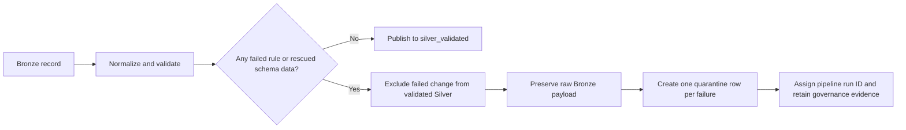

# Silver Validated Data Quality Rules Evidence

## Evidence scope

This document records evidence from the team workspace. Two successful runs are used for different purposes:

- **Latest run `528589439726686`** shows current pipeline health. It processed no new Bronze changes and therefore created no new quarantine rows.
- **Failure-evidence run `192086141413903`** produced the retained quarantine records. It is the correct run for failed-rule counts, quarantine totals, and failed-record samples.

The quarantine table is append-oriented evidence. A later incremental run that processes no new changes does not revalidate, reassign, resolve, or remove records created by an earlier validation run. Therefore, the retained `235,242` entries are historical failure events—not a count of currently unresolved records.

> **Interpretation:** use the latest run to report current execution health and the earlier failure-evidence run to demonstrate rule failures and quarantine handling. Do not combine the latest run ID with the historical quarantine total or present the historical total as the latest run's result.

| Evidence item | Value |
|---|---|
| Environment | Team workspace |
| Latest run ID | `528589439726686` |
| Latest run business date | `2026-07-10` |
| Latest run time | 2 August 2026, 14:44:09–14:48:03 UTC |
| Failure-evidence run ID | `192086141413903` |
| Failure-evidence business date | `2026-07-07` |
| Failure-evidence run time | 29 July 2026, 16:18:11–16:27:44 UTC |
| Execution status | Both runs `SUCCEEDED` |
| Evidence collected at | 3 August 2026 |

The following query verifies both selected runs:

```sql
SELECT
  pipeline_run_id,
  pipeline_name,
  business_date,
  execution_status,
  start_time,
  end_time
FROM workspace.governance.pipeline_run
WHERE pipeline_name = 'full-pipeline'
  AND pipeline_run_id IN ('528589439726686', '192086141413903')
ORDER BY end_time DESC;
```

Use `<latest-run-id>` for current-health queries and `<failure-evidence-run-id>` for failure and quarantine queries.

## 1. Validation summary

### Latest-run health

| Metric | Result |
|---|---:|
| Tables measured | **41** |
| Bronze rows recorded for this run | **0** |
| Validated Silver rows measured | **244,554** |
| New atomic quarantine records | **0** |
| Post-validation checks executed | **123** |
| Post-validation checks with failures | **0** |

The latest run was a successful incremental execution with no new Bronze changes. Its zero quarantine count means no new failures were added. It does not show that earlier failures were corrected, because those records were not reprocessed and the historical quarantine entries were not updated.

### Failure-evidence run summary

| Metric | Result |
|---|---:|
| Tables measured | **41** |
| Bronze rows measured | **6,229,013** |
| Validated Silver rows measured | **5,982,131** |
| Atomic quarantine records | **235,242** |
| Post-validation checks executed | **123** |
| Post-validation checks with failures | **0** |

```sql
WITH latest_table_metric AS (
  SELECT *
  FROM workspace.governance.table_quality_metrics
  WHERE pipeline_run_id = '<selected-run-id>'
  QUALIFY ROW_NUMBER() OVER (
    PARTITION BY table_name
    ORDER BY recorded_at DESC
  ) = 1
),
latest_audit AS (
  SELECT *
  FROM workspace.governance.data_quality_audit_log
  WHERE pipeline_run_id = '<selected-run-id>'
    AND rule_name IN (
      'current_business_keys_unique',
      'scd2_intervals_valid',
      'validated_rows_pass_all_rules'
    )
  QUALIFY ROW_NUMBER() OVER (
    PARTITION BY target_table_name, rule_name
    ORDER BY evaluated_at DESC, audit_id DESC
  ) = 1
)
SELECT
  (SELECT COUNT(*) FROM latest_table_metric) AS tables_measured,
  (SELECT COALESCE(SUM(bronze_change_rows), 0) FROM latest_table_metric)
    AS bronze_rows_measured,
  (SELECT COALESCE(SUM(clean_current_rows), 0) FROM latest_table_metric)
    AS validated_silver_rows_measured,
  (SELECT COALESCE(SUM(quarantined_rows), 0) FROM latest_table_metric)
    AS atomic_quarantine_records,
  (SELECT COUNT(*) FROM latest_audit) AS post_validation_checks_executed,
  (SELECT COUNT(*) FROM latest_audit WHERE records_failed > 0)
    AS post_validation_checks_with_failures;
```

Interpretation notes:

- Run the summary query once with the latest run ID and once with the failure-evidence run ID.
- `bronze_change_rows` is the Bronze count written by the audit; the latest incremental run recorded zero.
- `clean_current_rows` currently contains the validated table count and can include retained SCD2 history.
- `quarantined_rows` counts atomic failure records. One source record can contribute more than one atomic failure.

## 2. Passed rule count

### Evidence result

| Metric | Result |
|---|---:|
| Configured static rules | `76` |
| Static rules with no recorded failure | **29** |
| Static rules with one or more failures | **47** |

For a complete run covering all 41 source tables, a configured static rule is counted as passed when its rule name has no quarantine record for the selected run.

```sql
WITH failed_static_rule AS (
  SELECT DISTINCT failed_rule_name
  FROM workspace.governance.silver_quarantine_record
  WHERE pipeline_run_id = '<failure-evidence-run-id>'
    AND failed_rule_name <> 'RESCUED_DATA_PRESENT'
    AND failed_rule_name NOT LIKE '%__national_id__duplicate'
    AND failed_rule_name NOT LIKE '%__duplicate_active'
)
SELECT
  76 AS configured_static_rules,
  76 - COUNT(*) AS passed_rule_count,
  COUNT(*) AS failed_rule_count
FROM failed_static_rule;
```

This is a rule coverage count, not a passed-row count. Confirm that the validation summary contains all 41 tables before using this calculation as evidence.

## 3. Failed rule count

### Evidence result

| Failure category | Distinct failed rules or controls | Atomic failure records |
|---|---:|---:|
| Static data-quality rule | **47** | **233,821** |
| Generated duplicate control | **1** | **1,421** |
| Rescued schema content | **0** | **0** |
| **Total** | **48** | **235,242** |

```sql
WITH category(failure_category) AS (
  VALUES
    ('Static data-quality rule'),
    ('Generated duplicate control'),
    ('Rescued schema content')
),
failure AS (
  SELECT
    CASE
      WHEN failed_rule_name = 'RESCUED_DATA_PRESENT'
        THEN 'Rescued schema content'
      WHEN failed_rule_name LIKE '%__national_id__duplicate'
        OR failed_rule_name LIKE '%__duplicate_active'
        THEN 'Generated duplicate control'
      ELSE 'Static data-quality rule'
    END AS failure_category,
    failed_rule_name
  FROM workspace.governance.silver_quarantine_record
  WHERE pipeline_run_id = '<failure-evidence-run-id>'
),
category_result AS (
  SELECT
    category.failure_category,
    COUNT(DISTINCT failure.failed_rule_name) AS distinct_failed_rules_or_controls,
    COUNT(failure.failed_rule_name) AS atomic_failure_records
  FROM category
  LEFT JOIN failure USING (failure_category)
  GROUP BY category.failure_category
)
SELECT * FROM category_result
UNION ALL
SELECT
  'Total',
  COUNT(DISTINCT failed_rule_name),
  COUNT(*)
FROM failure
ORDER BY
  CASE failure_category
    WHEN 'Static data-quality rule' THEN 1
    WHEN 'Generated duplicate control' THEN 2
    WHEN 'Rescued schema content' THEN 3
    ELSE 4
  END;
```

### Highest-volume failed rules

| Source table | Failed rule | Atomic failures |
|---|---|---:|
| `card_transaction_status_event` | `card_transaction_status_event__status_timestamp__sane_range` | 150,564 |
| `account_transaction_status_event` | `account_transaction_status_event__account_txn_id__resolved` | 15,512 |
| `card_transaction_status_event` | `card_transaction_status_event__card_txn_id__resolved` | 10,684 |
| `account_transaction` | `account_transaction__account_id__resolved` | 5,168 |
| `account_transaction` | `account_transaction__credit_amount__non_negative` | 5,168 |
| `account_transaction_risk_score` | `account_transaction_risk_score__account_txn_id__resolved` | 5,168 |
| `core_banking_customer` | `core_banking_customer__national_id__not_null` | 3,561 |
| `card_transaction` | `card_transaction__card_id__resolved` | 3,560 |
| `crm_customer` | `crm_customer__national_id__not_null` | 3,201 |
| `crm_customer` | `crm_customer__email__not_malformed` | 3,199 |

Use the following query for the detailed rule breakdown:

```sql
SELECT
  source_table_name,
  failed_rule_name,
  quarantine_reason,
  COUNT(*) AS atomic_failure_records,
  COUNT(DISTINCT bronze_record_ref) AS affected_source_records
FROM workspace.governance.silver_quarantine_record
WHERE pipeline_run_id = '<failure-evidence-run-id>'
GROUP BY source_table_name, failed_rule_name, quarantine_reason
ORDER BY atomic_failure_records DESC, source_table_name, failed_rule_name;
```

## 4. Quarantined record count

### Evidence result

| Metric | Result |
|---|---:|
| Distinct quarantined source records | **231,755** |
| Atomic quarantine records | **235,242** |
| Records failing more than one rule | **3,487** |
| Maximum failures on one record | **2** |

```sql
WITH source_record AS (
  SELECT
    source_table_name,
    bronze_record_ref,
    COUNT(*) AS failure_count
  FROM workspace.governance.silver_quarantine_record
  WHERE pipeline_run_id = '<failure-evidence-run-id>'
  GROUP BY source_table_name, bronze_record_ref
)
SELECT
  COUNT(*) AS distinct_quarantined_source_records,
  SUM(failure_count) AS atomic_quarantine_records,
  COUNT_IF(failure_count > 1) AS records_failing_multiple_rules,
  MAX(failure_count) AS maximum_failures_on_one_record
FROM source_record;
```

Quarantine counts by table:

```sql
SELECT
  source_table_name,
  COUNT(DISTINCT bronze_record_ref) AS distinct_quarantined_source_records,
  COUNT(*) AS atomic_quarantine_records
FROM workspace.governance.silver_quarantine_record
WHERE pipeline_run_id = '<failure-evidence-run-id>'
GROUP BY source_table_name
ORDER BY distinct_quarantined_source_records DESC, source_table_name;
```

The distinct record count and atomic record count serve different purposes. Use distinct source records to report how many records were rejected by the failure-evidence run. Use atomic quarantine records to report how many failure events that run preserved. Neither number represents a current unresolved backlog unless a separate remediation-status process is implemented and queried.

## 5. Sample failed records

### Evidence result

The failing fields below were queried directly from each synthetic record's preserved Bronze payload. Only the record reference and field values responsible for the failure are shown; unrelated payload fields are excluded.

| Bronze record reference | Failed field | Actual failed value | Failed rule |
|---|---|---|---|
| `account.account_id=92916` | `cif_number` | `CIF99999999` | `account__cif_number__resolved` |
| `account_transaction.account_txn_id=215428` | `direction`, `amount` | `direction=CREDIT, amount=-100.0` | `account_transaction__credit_amount__non_negative` |
| `card.card_id=CARD-2523943864` | `card_number` | `INVALID-PAN` | `card__card_number__not_invalid_pan` |
| `card_transaction_status_event.status_event_id+card_txn_id=CTSE-5856746024:187790` | `status_timestamp` | `2018-07-26T19:48:09.000Z` | `card_transaction_status_event__status_timestamp__sane_range` |
| `core_banking_customer.cust_no=CB-202607050000878` | `date_of_birth` | `NULL` | `core_banking_customer__date_of_birth__not_null` |
| `core_banking_customer.cust_no=CB-9730072` | `national_id` | `804104299` | `core_banking_customer__national_id__duplicate` |
| `crm_customer.party_id=CRM-5763668` | `email` | `malformed-email` | `crm_customer__email__not_malformed` |

The following query reproduces the actual failed-field evidence without returning the complete record payload:

```sql
WITH sample AS (
  SELECT
    bronze_record_ref,
    failed_rule_name,
    quarantine_data_payload
  FROM workspace.governance.silver_quarantine_record
  WHERE pipeline_run_id = '<failure-evidence-run-id>'
    AND failed_rule_name IN (
      'account__cif_number__resolved',
      'account_transaction__credit_amount__non_negative',
      'card__card_number__not_invalid_pan',
      'card_transaction_status_event__status_timestamp__sane_range',
      'core_banking_customer__date_of_birth__not_null',
      'core_banking_customer__national_id__duplicate',
      'crm_customer__email__not_malformed'
    )
    AND (
      failed_rule_name <> 'crm_customer__email__not_malformed'
      OR get_json_object(quarantine_data_payload, '$.email') = 'malformed-email'
    )
  QUALIFY ROW_NUMBER() OVER (
    PARTITION BY failed_rule_name
    ORDER BY quarantine_key
  ) = 1
)
SELECT
  bronze_record_ref,
  failed_rule_name,
  CASE
    WHEN failed_rule_name = 'account__cif_number__resolved'
      THEN 'cif_number'
    WHEN failed_rule_name = 'account_transaction__credit_amount__non_negative'
      THEN 'direction, amount'
    WHEN failed_rule_name = 'card__card_number__not_invalid_pan'
      THEN 'card_number'
    WHEN failed_rule_name = 'card_transaction_status_event__status_timestamp__sane_range'
      THEN 'status_timestamp'
    WHEN failed_rule_name = 'core_banking_customer__date_of_birth__not_null'
      THEN 'date_of_birth'
    WHEN failed_rule_name = 'core_banking_customer__national_id__duplicate'
      THEN 'national_id'
    WHEN failed_rule_name = 'crm_customer__email__not_malformed'
      THEN 'email'
  END AS failed_field,
  CASE
    WHEN failed_rule_name = 'account__cif_number__resolved'
      THEN get_json_object(quarantine_data_payload, '$.cif_number')
    WHEN failed_rule_name = 'account_transaction__credit_amount__non_negative'
      THEN CONCAT(
        'direction=', get_json_object(quarantine_data_payload, '$.direction'),
        ', amount=', get_json_object(quarantine_data_payload, '$.amount')
      )
    WHEN failed_rule_name = 'card__card_number__not_invalid_pan'
      THEN get_json_object(quarantine_data_payload, '$.card_number')
    WHEN failed_rule_name = 'card_transaction_status_event__status_timestamp__sane_range'
      THEN get_json_object(quarantine_data_payload, '$.status_timestamp')
    WHEN failed_rule_name = 'core_banking_customer__date_of_birth__not_null'
      THEN COALESCE(
        get_json_object(quarantine_data_payload, '$.date_of_birth'),
        'NULL'
      )
    WHEN failed_rule_name = 'core_banking_customer__national_id__duplicate'
      THEN get_json_object(quarantine_data_payload, '$.national_id')
    WHEN failed_rule_name = 'crm_customer__email__not_malformed'
      THEN get_json_object(quarantine_data_payload, '$.email')
  END AS actual_failed_value
FROM sample
ORDER BY failed_rule_name;
```

## 6. How failure handling works



| Stage | Failure-handling behavior |
|---|---|
| Single assessment | The Bronze change is normalized and evaluated once. The same result controls the validated and quarantine branches. |
| Failure collection | Every failed static rule and generated duplicate control is added to a failure-name array. Non-empty rescued schema content adds `RESCUED_DATA_PRESENT`. |
| Validated output | A record is published to `silver_validated.<table_name>` only when the failure array is empty and no rescued schema content exists. |
| SCD2 handling | Quarantine keeps the authoritative active SCD2 version and suppresses superseded historical versions. Passing SCD2 history remains available in validated Silver. |
| Atomic quarantine | The failure array is exploded, producing one quarantine row per failed rule or schema condition. |
| Evidence preservation | Each quarantine row retains the source identity, failure name, reason, timestamp, rescued schema content, and complete original Bronze payload. |
| Run attribution | The dependent validation audit assigns the Databricks job run ID to new quarantine records so evidence can be reported for one pipeline execution. |
| Investigation | Report distinct rejected source records separately from atomic failure records, then use the preserved payload only under appropriate data-access controls. |